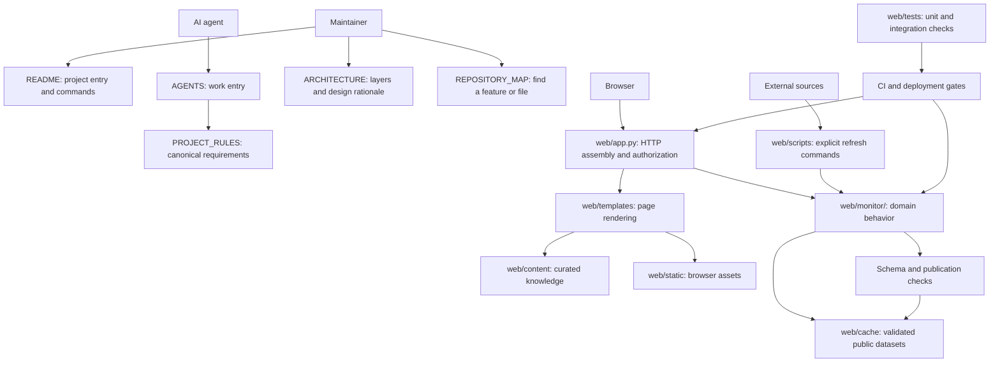

# Repository Architecture

This document explains why the repository is divided into these layers and offers a reusable starting point for other projects. It describes architecture and boundaries; it is not a second policy document.

## Architecture Diagram



## Layer Responsibilities

| Layer             | Location in this repository                 | Responsibility                                                                                 |
| ----------------- | ------------------------------------------- | ---------------------------------------------------------------------------------------------- |
| Project entry     | Root`README.md` or service README         | Goals, setup, common commands, and links to deeper documentation                               |
| Canonical rules   | `PROJECT_RULES.md`                        | Repository-wide requirements; the only authoritative policy source                             |
| Agent entry       | `AGENTS.md` and `.github/` instructions | How an agent discovers and applies canonical rules; platform-specific additions only           |
| Architecture      | `ARCHITECTURE.md`                         | System boundaries, dependencies, root-file rationale, and reusable structure                   |
| File lookup       | `REPOSITORY_MAP.md`                       | Where a feature's code, data, interface, tests, and manual live                                |
| Runtime entry     | `web/app.py`                              | Assemble the web application and coordinate HTTP/authentication; avoid domain calculations     |
| Domain code       | `web/monitor/<feature>/`                  | Group a feature's source client, validation, calculations, and storage behind clear interfaces |
| Interface         | `web/templates/`, `web/static/`         | Render views and serve browser assets; do not own upstream data collection                     |
| Curated content   | `web/content/`                            | Human-authored game knowledge, separate from executable code and generated data                |
| Public datasets   | `web/cache/`                              | Validated, versioned data consumed by request handlers; document source and refresh ownership  |
| Operations        | `web/scripts/`                            | Explicit local, refresh, validation, and deployment commands                                   |
| Technical manuals | `web/docs/`                               | Feature-specific behavior, setup, limitations, and acceptance procedures                       |
| Verification      | `web/tests/`                              | Unit tests for domain behavior and integration tests for routes/cross-layer contracts          |

## Why Some Files Stay at the Root

Classify by responsibility, but keep files at a root when tooling or convention expects them there:

| File or pattern      | Reason to keep at the project/service root                                          |
| -------------------- | ----------------------------------------------------------------------------------- |
| `app.py`           | Flask/Gunicorn import target used by the current runtime command                    |
| `README.md`        | The default entry point shown by Git hosts and editors                              |
| `Dockerfile`       | The build context and platform convention expect it at the service root             |
| `requirements.txt` | Simple installation and existing container build steps read it directly             |
| `.env.example`     | Common dotenv tooling and setup instructions find it beside the application         |
| `.env`             | Local-only configuration; ignored by Git and never a template for committed secrets |

Move supporting commands and long-form manuals into `scripts/` and `docs/`. Do not preserve duplicate copies merely to keep an old path alive. If an external platform requires a root path, keep only the required entry point there and delegate to the owning module.

## Reusable Project Shape

Adapt this structure to the project's language and build tools; the boundaries matter more than these exact names:

```text
project/
  README.md                 overview and quick start
  ARCHITECTURE.md           design and dependency boundaries
  PROJECT_RULES.md          canonical repository requirements, if needed
  AGENTS.md                 agent entry that points to canonical rules
  REPOSITORY_MAP.md         feature/file lookup for a non-trivial repository
  .github/                  CI and platform-specific instructions
  app-entry                 only when the runtime/tool convention requires it
  package-and-build-files   language/package manager and container metadata
  src-or-domain/            source grouped by feature or bounded context
  templates-or-ui/          presentation layer
  assets/                   static resources
  content/                  curated, non-executable project content
  data-or-cache/            generated/public data, with private state excluded
  scripts/                  explicit maintenance, validation, and deployment commands
  docs/                     architecture-adjacent and feature operation manuals
  tests/
    unit/
    integration/
```

For a monorepo, keep shared governance and architecture at the repository root, then give each independently built service its own entry point, dependencies, scripts, docs, and tests. Avoid creating empty categories before a real responsibility needs them.

## Moving Files Safely

1. Identify the owning feature and responsibility before choosing a destination.
2. Check imports, mocks, resource paths, `__file__`-relative data paths, working directories, package/build configuration, CI workflows, and Markdown links.
3. Move one related group at a time; update references in the same change and remove stale copies.
4. Run the narrow command first, then package/test discovery and affected integration or browser checks.
5. Update `REPOSITORY_MAP.md` and the relevant README/manual. Report external systems that remain blocked instead of treating a passing fixture as a live integration.

## Related Documents

- Canonical rules: [`PROJECT_RULES.md`](PROJECT_RULES.md)
- Agent entry: [`AGENTS.md`](AGENTS.md)
- File lookup: [`REPOSITORY_MAP.md`](REPOSITORY_MAP.md)
- Web project guide: [`web/README.md`](web/README.md)
- Web validation: [`web/docs/VALIDATION.md`](web/docs/VALIDATION.md)
