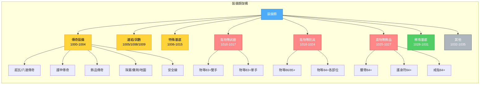

# POE 物品篩選器說明文件

## 📋 基本資訊

- **編輯者**: 蘭鐸 (Lantor)
- **版本**: POE v3.27
- **更新日期**: 2025.11.12
- **編輯工具**: [Filtration](https://github.com/ben-wallis/Filtration)
- **基於**: NeverSink 國際服過濾器（已修改裝備類與地圖樣式）
- **語言**: 英文（國際服可用）

## 🎯 功能說明

這是一個專為 Path of Exile (流亡黯道) 遊戲設計的物品篩選器腳本，用於過濾和高亮顯示遊戲中掉落的物品。主要功能包括：

### 核心功能
- **智能過濾**: 根據物品價值、稀有度和用途自動過濾顯示
- **視覺增強**: 為不同等級的物品設定不同的背景色、邊框和音效
- **分級管理**: 將物品分為多個優先級（T1-T7），方便識別
- **聯盟支援**: 涵蓋歷代聯盟物品（從 3.8 至 3.27）
- **安全線設計**: 各分類設有安全線，避免遺漏重要物品

### 適用場景
- **拓荒階段**: 包含拓荒專用基底過濾
- **終局遊戲**: 專注於高價值物品（可刪除拓荒相關區塊）
- **工藝製作**: 標示適合工藝的高物等基底
- **商店配方**: 突顯可用於商店配方的物品

## 🏗️ 架構說明

篩選器採用**模組化設計**，分為 8 大類別，每類別下又細分為多個區段 (Section)，總計包含超過 70 個區段。

### 架構層級
```
POE篩選器
├── 一、裝備類 (Section 1000-1035)
├── 二、通貨類 (Section 2000-2020)
├── 三、藥劑/萃取物 (Section 3001-3002)
├── 四、珠寶 (Section 4001-4003)
├── 五、技能石 (Section 5001)
├── 六、地圖及其碎片 (Section 6001-6005)
├── 七、命運卡 (Section 7001-7002)
└── 八、特殊物品 (Section 8001-8021)
```

## 📊 架構圖

### 整體架構流程圖

```mermaid
graph TB
    Start[遊戲掉落物品] --> Filter{POE篩選器}
    
    Filter --> Cat1[一、裝備類]
    Filter --> Cat2[二、通貨類]
    Filter --> Cat3[三、藥劑/萃取物]
    Filter --> Cat4[四、珠寶]
    Filter --> Cat5[五、技能石]
    Filter --> Cat6[六、地圖及其碎片]
    Filter --> Cat7[七、命運卡]
    Filter --> Cat8[八、特殊物品]
    
    Cat1 --> E1[傳奇裝備<br/>1000-1004]
    Cat1 --> E2[6L/5L/6S<br/>1005/1008/1009]
    Cat1 --> E3[聯盟/勢力基底<br/>1006-1015]
    Cat1 --> E4[高物等裝備<br/>1016-1027]
    Cat1 --> E5[稀有基底<br/>1028-1031]
    Cat1 --> E6[商店配方/安全線<br/>1032-1035]
    
    Cat2 --> C1[聯盟通貨<br/>2000/2019/2020]
    Cat2 --> C2[標準通貨T1-T7<br/>2001-2008]
    Cat2 --> C3[特殊通貨<br/>2009-2018]
    
    Cat3 --> P1[藥劑 3001]
    Cat3 --> P2[萃取物 3002]
    
    Cat4 --> J1[天賦珠寶 4001]
    Cat4 --> J2[深淵珠寶 4002]
    Cat4 --> J3[星團珠寶 4003]
    
    Cat5 --> S1[技能石 5001]
    
    Cat6 --> M1[凋落地圖 6001]
    Cat6 --> M2[T1-T17地圖 6002]
    Cat6 --> M3[地圖碎片 6003]
    Cat6 --> M4[劫盜藍圖 6004]
    Cat6 --> M5[探險日誌 6005]
    
    Cat7 --> D1[命運卡 7001-7002]
    
    Cat8 --> SP1[任務/迷宮 8001-8002]
    Cat8 --> SP2[裂痕/聯盟石 8003/8007]
    Cat8 --> SP3[各聯盟物品 8004-8021]
    
    style Filter fill:#ff6b6b,stroke:#c92a2a,color:#fff
    style Cat1 fill:#4dabf7,stroke:#1971c2,color:#fff
    style Cat2 fill:#51cf66,stroke:#2f9e44,color:#fff
    style Cat3 fill:#ffd43b,stroke:#f08c00,color:#000
    style Cat4 fill:#ff8787,stroke:#e03131,color:#fff
    style Cat5 fill:#a78bfa,stroke:#7c3aed,color:#fff
    style Cat6 fill:#ffa94d,stroke:#e67700,color:#fff
    style Cat7 fill:#74c0fc,stroke:#1864ab,color:#fff
    style Cat8 fill:#b197fc,stroke:#7950f2,color:#fff
```



### 裝備類詳細架構



### 通貨類分級架構

```mermaid
graph TD
    A[通貨類] --> B[最新聯盟通貨<br/>2000/2019/2020]
    A --> C[標準通貨系統]
    A --> D[歷史聯盟通貨<br/>2009-2018]
    
    C --> T7[T7: 卷軸類 2001]
    C --> T6[T6: 磨刀/護甲 2002]
    C --> T5[T5: 蛻變/增幅 2003]
    C --> T4[T4: 機會/幻色 2004]
    C --> T3[T3: 改造/鏈結 2005]
    C --> T2[T2: 後悔/稜鏡 2006]
    C --> T15[T1.5: 覺醒六分儀 2007]
    C --> T1[T1: 崇高/鏡子 2008]
    
    B --> N1[3.27黯焰看守者]
    B --> N2[3.25卡爾葛拓荒者]
    B --> N3[3.26輿圖之奧秘]
    
    D --> L1[精髓 2010]
    D --> L2[穿越 2011]
    D --> L3[掘獄 2012]
    D --> L4[凋落油 2013]
    D --> L5[劫盜 2015]
    D --> L6[探險 2016]
    D --> L7[其他聯盟]
    
    style A fill:#51cf66,stroke:#2f9e44,color:#fff
    style T1 fill:#ff6b6b,stroke:#c92a2a,color:#fff
    style T15 fill:#ff8787,stroke:#e03131,color:#fff
    style T2 fill:#ffa94d,stroke:#e67700,color:#fff
    style T3 fill:#ffd43b,stroke:#f08c00,color:#000
    style T4 fill:#a9e34b,stroke:#5c940d,color:#000
    style T5 fill:#74c0fc,stroke:#1864ab,color:#fff
    style T6 fill:#b197fc,stroke:#7950f2,color:#fff
    style T7 fill:#e9ecef,stroke:#868e96,color:#000
```



## 📑 詳細分類索引

### 一、裝備類 (Section 1000-1035)

#### 傳奇裝備 (1000-1004)
- **1000**: 超瓦雙詞傳奇、六連傳奇、雙深淵洞以上傳奇、穢生傳奇、傳奇武器
- **1001**: 護甲傳奇
- **1002**: 飾品傳奇
- **1003**: 珠寶、藥劑、萃取物、地圖傳奇
- **1004**: 其他傳奇（安全線）

#### 連結與孔洞 (1005/1008/1009)
- **1005**: 六連裝備 (6L)
- **1008**: 五連裝備 (5L)
- **1009**: 六洞裝備 (6S)

#### 特殊基底 (1006-1015)
- **1006**: 尊師、塑界者地圖、勢力基底物品
- **1007**: 神喻聯盟裝備碎片
- **1010**: 聯盟詞墜物品（Q29+、各聯盟特殊詞綴）
- **1011**: 已鑑定未污染好詞綴魔法（稀有）物品
- **1012**: 點機會石的基底（如術士長靴）
- **1013**: 特殊聯盟新基底（祭祀、劫盜、異界、死境、卡蘭德迷湖等）
- **1014**: 深淵腰帶
- **1015**: 火靈用粗製弓、工藝基底

#### 高物等裝備 (1016-1027)
**武器類:**
- **1016**: 物等83+雙手武器（長杖84+）
- **1017**: 物等83+單手武器（法杖權杖84+）

**防具類:**
- **1018**: 胸甲盾牌86+/頭部85+
- **1019**: 頭部84+
- **1020**: 胸甲84+
- **1021**: 手套84+
- **1022**: 鞋子84+
- **1023**: 盾牌84+
- **1024**: 箭袋84+

**飾品類:**
- **1025**: 腰帶84+
- **1026**: 護身符84+
- **1027**: 戒指84+

#### 稀有基底 (1028-1031)
- **1028**: 稀有裝備（好基底）- 不限等武器
- **1029**: 稀有裝備（好基底）- 不限等防具
- **1030**: 稀有裝備（好基底）- 不限等副手
- **1031**: 稀有裝備（好基底）- 不限等飾品

#### 其他裝備 (1032-1035)
- **1032**: 拓荒點金基底（終局玩家可刪除）
- **1033**: 商店配方專用
- **1034**: 其他所有稀有裝備（差基底）- **稀有裝備安全線**
- **1035**: 其他所有魔法及普通裝備（背景透明）- **白藍裝備安全線**

---

### 二、通貨類 (Section 2000-2020)

#### 最新聯盟通貨
- **2000**: 3.16轉世災魘通貨、3.27黯焰看守者通貨（植入物、穢生通貨）
- **2019**: 3.25卡爾葛拓荒者物品（黃金、映像迷霧、釋界製圖釘）
- **2020**: 3.26輿圖之奧秘通貨（巨靈瓦爾寶珠、回想石、符文之結等）

#### 標準通貨分級 (T1-T7)
- **2001 (T7)**: 知識卷軸、傳送卷軸
- **2002 (T6)**: 磨刀石、護甲片
- **2003 (T5)**: 蛻變石、增幅石
- **2004 (T4)**: 機會石、幻色石、工匠石、地平石
- **2005 (T3)**: 改造石、玻璃彈珠、祝福石、鏈結石、點金石、製圖釘、工程石
- **2006 (T2)**: 後悔石、寶石匠的稜鏡、製圖六分儀（簡易）、重鑄石、束縛石、粉碎石
- **2007 (T1.5)**: 製圖六分儀（覺醒/精華）、神諭石
- **2008 (T1)**: 隱匿石、永恆寶珠、卡蘭德的魔鏡、崇高石、神聖石、覺醒寶珠、破裂石

#### 歷史聯盟通貨 (2009-2018)
- **2009**: 神諭通貨碎片
- **2010**: 精髓
- **2011**: 穿越通貨
- **2012**: 掘獄通貨
- **2013**: 3.8凋落通貨（油瓶）
- **2014**: 最後通牒通貨
- **2015**: 3.12劫盜通貨
- **2016**: 3.15死境探險通貨
- **2017**: 3.21熔火冥獄通貨
- **2018**: 3.22祖靈試鍊通貨

---

### 三、藥劑/萃取物 (Section 3001-3002)
- **3001**: 藥劑
- **3002**: 萃取物

---

### 四、珠寶 (Section 4001-4003)
- **4001**: 天賦珠寶
- **4002**: 深淵珠寶
- **4003**: 譫妄星團珠寶

---

### 五、技能石 (Section 5001)
- **5001**: 技能石

---

### 六、地圖及其碎片 (Section 6001-6005)
- **6001**: 3.8凋落地圖
- **6002**: T1~T17地圖（含安全線）
- **6003**: 地圖碎片（含安全線）
- **6004**: 劫盜藍圖、契約
- **6005**: 3.15死境探險日誌

---

### 七、命運卡 (Section 7001-7002)
- **7001**: 命運卡
- **7002**: 其他命運卡（安全線）

---

### 八、特殊物品 (Section 8001-8021)

#### 常駐內容 (8001-8008)
- **8001**: 任務道具
- **8002**: 迷宮物品
- **8003**: 裂痕物品
- **8004**: 還原玉、拓印印記、製圖封印
- **8006**: 普蘭德斯金幣
- **8007**: 聯盟石
- **8008**: 各類遺鑰（古典、古朽、文書、宇宙、腐化等14種）
- **8009**: 魚竿

#### 歷史聯盟物品 (8010-8021)
- **8010**: 穿越聯盟物品
- **8011**: 3.7戰亂聯盟物品
- **8012**: 3.10譫妄聯盟物品
- **8013**: 3.11豐收聯盟物品
- **8014**: 3.12劫盜聯盟物品
- **8015**: 3.13祭祀聯盟物品
- **8016**: 3.17宿敵聯盟物品
- **8017**: 3.18守望聯盟物品、各大師記憶
- **8018**: 3.20禁忌聖域聯盟物品（聖物）
- **8019**: 3.23禁咒荒林聯盟物品（咒語、屍體）
- **8020**: 3.25費西亞的遺產物品（魔偶）
- **8021**: 3.26特拉特斯傭兵物品

---

## 🛠️ 使用說明

### 安裝步驟
1. 下載篩選器文件
2. 將文件放置於 POE 篩選器目錄：
   - Windows: `%USERPROFILE%/Documents/My Games/Path of Exile/`
   - Steam: `Steam/userdata/<user-id>/238960/local/`
3. 在遊戲設定中選擇該篩選器

### 使用 Filtration 編輯
1. 下載並安裝 [Filtration](https://github.com/ben-wallis/Filtration)
2. 開啟篩選器文件（檔案開頭需有 `# EnableBlockGroups` 指令）
3. 使用勾選框開啟/關閉特定區段
4. 儲存並重新載入至遊戲

### 自定義建議

#### 拓荒玩家
- 保留 **Section[1032]** 拓荒點金基底
- 開啟所有通貨顯示（T1-T7）
- 顯示所有地圖掉落

#### 終局玩家
- 刪除或隱藏 **Section[1032]** 拓荒內容
- 可隱藏 T5-T7 低階通貨
- 調整地圖層級顯示（只顯示紅圖等）

#### 工藝玩家
- 關注 **Section[1016-1027]** 高物等基底
- 保留 **Section[1013]** 特殊基底
- 顯示特定基底類型（可自行添加/刪除）

#### 商店配方玩家
- 保留 **Section[1033]** 商店配方區
- 關注 6S 裝備（換珠寶商稜鏡）
- 注意幻色裝備（換幻色石）

### 安全線機制
篩選器在多個類別設有**安全線 (Safety Net)**，確保不會遺漏重要物品：
- 傳奇裝備安全線：**Section[1004]**
- 稀有裝備安全線：**Section[1034]**
- 白藍裝備安全線：**Section[1035]**
- 地圖安全線：**Section[6002]**
- 地圖碎片安全線：**Section[6003]**
- 命運卡安全線：**Section[7002]**

## 📝 維護與更新

### 添加新基底
1. 確認物品的英文名稱
2. 找到對應的 Section
3. 在適當位置添加物品規則
4. 測試並調整顯示效果

### 新聯盟適配
1. 在對應類別添加新 Section（如 8022 for 3.28聯盟）
2. 在通貨類添加新聯盟通貨（如 2021）
3. 更新檔案頭部的索引註解
4. 更新版本號和日期

### 版本管理建議
- 定期備份篩選器文件
- 在檔案名中包含版本號（如 `篩選器_v3.27`）
- 記錄每次修改的內容

## 💡 進階技巧

### 音效設定
- T1 通貨通常配置高音效提示
- 傳奇裝備配置醒目音效
- 命運卡配置特殊音效

### 顏色編碼
- **紅色系**: 高價值物品（T1通貨、傳奇）
- **橙色系**: 中高價值物品（T2-T3通貨）
- **黃綠色系**: 中等價值物品（T4-T5通貨）
- **藍紫色系**: 低價值但有用物品（技能石、珠寶）
- **灰色系**: 最低優先級物品

### 字體大小調整
依據重要性設定字體大小，建議範圍：
- 極重要：45
- 很重要：40-42
- 重要：36-38
- 一般：32-34
- 次要：28-30
- 最低：24-26

## 🔗 相關資源

- [Filtration 編輯器](https://github.com/ben-wallis/Filtration)
- [NeverSink 篩選器](https://github.com/NeverSinkDev/NeverSink-Filter)
- [POE 官方篩選器文檔](https://www.pathofexile.com/item-filter/about)
- [FilterBlade 線上編輯器](https://www.filterblade.xyz/)

## 📮 回饋與建議

如有裝備基底想要增加或刪除，或有任何建議，歡迎提供討論！

---

**最後更新**: 2025.11.12  
**製作**: 蘭鐸 (Lantor)  
**適用版本**: POE v3.27
