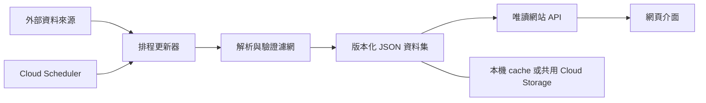

# PoE 專案核心規範

- 文件版本：1.0.7
- 更新日期：2026-10-06
- 適用範圍：本倉庫所有網站、工具、資料集、內容與文件
- 規範用語：**必須**為合併前要求；**應該**為預設作法，例外需說明原因

本文件是專案建構的共同核心。單一功能文件可以補充細節，但不可推翻本規範；發現衝突時先修正文檔再實作，不自行默默選一套。

## 核心原則

1. **資料先成集，再供服務讀取。** 網頁請求不得直接向行情、爬蟲或其他不穩定來源即時取資料。
2. **需求先形成驗證濾網。** 每項行為需求都要有可執行或可人工重現的驗收條件；驗證由實作者負責。
3. **結構先於堆疊。** 程式、資料、內容與文件各有明確責任歸屬，新增功能先找既有位置，不複製第二套。
4. **文件與實作同步。** API、資料格式、資料夾或操作流程改變時，同步更新對應文件和變更紀錄。

## CORE-001：資料集與同步流程

### 責任邊界

- **來源更新器**：依排程或明確管理操作呼叫允許使用的外部 API，負責抓取、解析、篩選、驗證與記錄錯誤。
- **資料集**：保存已驗證、可直接供網站使用的結構化 JSON；它是網頁讀取行情的唯一入口。
- **網站 API**：只讀本機 JSON 或共用物件儲存中的 JSON，負責參數檢查與回傳；不得在一般 GET 請求中抓取上游資料。
- **前端**：只呼叫本網站 API，不直連資料來源，也不自行猜測、混用或補造價格。

### 資料集契約

- 每份資料集必須有 `schema_version`、`status`、`game`、`kind`、`category`、`league`、`fetched_at`、`source`、`categories`、`items`。`category` 表示資料集種類（如 `currency`／`unique`）；`categories` 是供導覽使用的 `{id, label}` 清單，可包含目前筆數為零的來源分類。
- 目前台服價格 `kind` 為 `currency`、`unique`、`gem`、`beast`；來源未支援的遊戲／類別需標示 unavailable 或拒絕請求，不能拿其他遊戲資料代替。
- `status` 至少區分 `ok` 與 `unavailable`；零筆資料不得被誤報為成功行情。時間欄位使用 UTC Unix 秒或 ISO 8601，單一資料集不得混用格式。
- `items` 內每種資料必須有穩定識別欄位；名稱、價格、分類等欄位依資料集種類定義並文件化。多分類項目需保留來源 category ID，不可更新時先篩掉。
- 以圖示呈現兌換比時，資料集另保存 `unit_icons` 對照，且每筆 item 保留物品圖示；缺少圖示時仍要能讀取名稱與價格。
- 分類圖示必須使用來源分類 metadata 的 `image`／`imageUrl`；來源未提供時可用該分類的代表物品圖。不得以自繪或任意 emoji 假造分類圖示；沒有來源圖片時顯示無圖示狀態。
- 台服交易連結使用已發布的官方名稱 metadata，區分 canonical `type`、傳奇 `name` 與變體 `discriminator`，不得把完整顯示名稱直接當基底型別。宝石帶入該筆等級、品質及腐化／未腐化條件，零品質與 false 必須保留；未知或歧義名稱不猜測。
- POE1 使用 `pathofexile.tw/trade/search/{league}?q=...`，POE2 使用 `pathofexile.tw/trade2/search/poe2/{league}?q=...`；必須 URL encode、另開分頁並設定 `rel="noopener noreferrer"`。官方名稱表保存於 `tw_trade_<game>.json`，更新器取得後原子發布，網頁只讀，不保存臨時查詢 URL。
- `price: null`／`priceStatus: unavailable` 表示沒有有效現價，傳奇／寶石不得回退到歷史 `lastPrice`／`medianChaos` 冒充現價。有效價格必須顯示數值與文字單位，不能靠可能缺失的 icon 傳遞單位；掛單開價、來源估價與成交價必須區分。
- 更新器先完整建立並驗證新資料，再以原子替換發布；失敗或格式不符時保留最後一份有效資料，不可先清空再重抓。
- 合法的「來源目前無資料」可以發布 `unavailable` 狀態，但必須保留原因與聯盟，不能用另一遊戲、聯盟或舊快取冒充最新價格。
- 本機資料集放在 `web/cache/`；Cloud Run 多實例必須使用共用持久儲存。產生資料不得手動修改，且須明確決定是否納入版控。
- 更新頻率、呼叫限制、授權方式與上游來源必須記錄；手動刷新 UI 只能重新讀取已發布資料集，不等同觸發上游抓取。

### 驗收濾網

- 測試一般 API 讀取時封鎖外網，仍能由資料集正常回應。
- 測試資料集缺漏、空資料、錯誤格式、未知遊戲／分類和上游失敗；回應狀態清楚且不覆蓋最後有效資料。
- 比對資料集筆數、聯盟、遊戲和分類，確認沒有跨遊戲／跨聯盟混資料。
- 每次改 schema 都要同步調整讀取端、更新器、範例資料與契約測試。

## CORE-002：需求濾網與驗證閘門

### 開工前

- 把需求拆成可觀察的行為、輸入／輸出、限制與不做事項；模糊或互相矛盾的條件先釐清。
- 列出驗收案例：正常路徑、邊界值、錯誤輸入、空資料、權限／失敗情況，以及相鄰功能不可回歸項目。
- 在改動前指出一個可反證的假設和一個最小檢查；找出擁有該行為的模組後，再修改其責任邊界。

### 完工前

- 先跑最窄且能推翻假設的檢查，再跑受影響 API／資料格式／UI 流程測試；不可只以「畫面看起來正常」代替驗證。
- 新增資料篩選時，明確列出 allow-list、排除條件、缺值處理、去重鍵、價格單位及排序依據，並測試每個條件。
- 新增 API 時，驗證成功與錯誤 HTTP 狀態、回應 schema、無效參數、來源不可用和授權邊界。
- 新增 UI 流程時，驗證互動、載入中、空資料、錯誤狀態、窄螢幕，以及是否意外離開既有導覽流程。
- 測試、人工瀏覽器檢查與靜態檢查由實作者執行並回報；不能把已知驗證工作留給使用者。
- 上線先在執行環境啟動並實測。部署 Cloud Run 或修改線上排程前，必須取得使用者明確授權。
- 使用者當次明確要求「部署／佈署到 Cloud Run」或在已明確指向 Cloud Run 的對話中要求「部署／佈署」，即視為該次部署的 OK，無須再次詢問；適用於電腦與手機 GitHub Copilot。這不代表往後所有修改都可自動部署，也不授權修改線上排程。
- 對話授權不取代 Google Cloud IAM、GitHub Actions 權限、分支保護與環境核准。若執行環境缺少憑證或部署入口，必須明確回報阻礙，不得宣稱已部署或繞過安全限制。

## CORE-003：程式、資料與目錄結構

- 新功能先確認責任模組與現有命名，沿用既有慣例；不得因單一功能複製第二份 API client、資料格式或相同用途頁面。
- 一項責任一個擁有者：來源連線與更新、資料驗證、API、UI、使用者內容不可混在同一層。跨層只透過明確契約傳遞資料。
- Web 專案預設目錄責任：

| 路徑 | 責任 |
|---|---|
| `web/app.py` | Flask 路由與應用組裝；商業計算移至所屬模組 |
| `web/monitor/` | 來源 client、解析、篩選、資料更新及監控邏輯 |
| `web/cache/` | 產生的本機 JSON／SQLite；說明來源、刷新方式與版控策略 |
| `web/content/<game>/<category>/` | 經人工整理的遊戲知識 Markdown |
| `web/templates/` | Jinja 頁面與局部 UI，不連接外部行情來源 |
| `web/static/` | 圖片、樣式、腳本等靜態資產 |
| `web/tests/` | 自動化測試；依 `unit/`、`integration/` 分離純邏輯與跨層流程 |

- 資料欄位使用 JSON／Python 結構化解析和型別檢查，不以字串切割猜 schema；金額、時間、聯盟與類別要明確命名及標示單位。
- 新目錄或模組只有在責任獨立、具重用性或符合既有架構時才建立；修改前保留使用者既有未提交內容，不做無關搬移。
- 機密只放未追蹤的環境設定或 Secret Manager；範例檔使用假值，不得包含實際密碼、token 或憑證。

## CORE-004：文件與知識內容結構

### 技術文件

功能、API 或資料集文件至少描述：目的與範圍、模組責任、資料流、資料／API 契約、設定與權限、錯誤／空資料行為、更新方式、驗收方法。架構穩定或功能跨模組時補 Mermaid：系統圖用 `graph TB`，時序流程用 `sequenceDiagram`。

專案 README 依序維護：目標、服務／模組表、功能、技術堆疊、架構與資料流程、目錄、快速開始、文件索引、版本化變更紀錄。狹義操作手冊可簡化，但必須連回核心架構與相關規範。

### 遊戲知識 Markdown

- 必須以單一 `# 標題` 開始；摘要放在標題後第一個 `- ` 清單項目，維持現有網站卡片摘要解析相容。
- 依內容選用清楚的 `##` 區段；適用時列前置條件、配置／步驟、成本與收益、風險、實測日期及資料來源。數值需標聯盟、單位與估價日期。
- 圖片放在對應 `static/` 資料夾，使用能辨識遊戲與主題的檔名，Markdown 連結沿用 `./檔名` 相對路徑；不得將大型圖片嵌入文字或用含糊名稱覆蓋舊檔。
- 舊文件先保持可讀；只在新增或實際修改時逐步套用，不為了格式一致而大量重寫未受影響內容。

## CORE-005：逐項功能驗收與缺陷回歸

- 適用範圍：網站功能修改、部署驗收及其驗證程序；驗證必須由實作者執行。
- 每次完成前建立功能矩陣，逐項記錄實際 PASS／FAIL／BLOCKED，包括首次載入、正常流程、空資料、錯誤輸入、權限缺漏、重新整理後狀態與桌機／手機操作。
- `/health` 或首頁 HTTP 200 只證明程序可回應，不能代表功能正常。圖片必須驗證可見性、有效來源與成功解碼；受保護功能必須驗證拒絕、成功授權、狀態保留及登出／鎖回。
- 每個已發現的缺陷必須補上能重現它的測試或驗證閘門，修正後重跑同一案例；同步更新共用驗證文件與專案記憶，記錄根因、驗收方法和未驗證限制。
- 缺少正式設定、帳號授權或外部服務時，標示 BLOCKED；fixture／mock 只可證明其測試範圍，不得冒充真實登入、行情刷新或正式部署驗證成功。
- 本站使用 `web/validate_site.py`、`web/tests/` 與 `web/VALIDATION.md` 維護功能矩陣。正式部署須檢查必要設定和 `/health/ready`，缺少策略密碼或固定 session key 時停止部署。
- 驗收報告不得含密碼、token、私鑰或完整 Secret 值。機密只檢查設定是否存在；讀取或修正正式設定仍須符合既有授權規則。

## CORE-006 之後：規則擴充方式

- 新規則由使用者提出後，新增下一個編號，包含適用範圍、必須行為、驗收濾網與例外處理；不要覆寫或暗中改變既有核心規則。
- 每次增修更新文件版本、日期與底部變更紀錄；若規則改變實作慣例，同步修正 README、範本或 agent 指示。
- 未來規則：由使用者逐步補充，本版不預先替使用者決定內容。

## 變更紀錄

| 版本 | 日期 | 內容 |
|---|---|---|
| 1.0.0 | 2026-10-05 | 建立資料集優先、驗證濾網、結構化目錄及文件結構四項核心規範。 |
| 1.0.1 | 2026-10-05 | 明確化多分類 JSON 契約、分類 metadata 與兌換單位圖示對照。 |
| 1.0.2 | 2026-10-05 | 明確要求上游空分類發布 `unavailable`，並以契約測試覆蓋空資料行為。 |
| 1.0.3 | 2026-10-05 | 列明 currency／unique／gem／beast 類型，規定官方台服交易連結安全格式。 |
| 1.0.4 | 2026-10-05 | 分類圖示限定來源 metadata 或來源代表物品圖，不使用自訂／emoji fallback。 |
| 1.0.5 | 2026-10-06 | 明確部署指令視為該次 OK，支援手機 Copilot；保留測試、IAM、環境核准與排程授權邊界。 |
| 1.0.6 | 2026-10-06 | 新增 CORE-005：逐項功能驗收、圖片解碼、授權狀態、缺陷回歸與 BLOCKED 報告，禁止以 HTTP 200 代替驗收。 |
| 1.0.7 | 2026-10-06 | 規範官方完整名稱與基底／變體查詢、寶石精確條件、POE2 trade2 路徑及 unavailable 現價不得回退歷史估價。 |