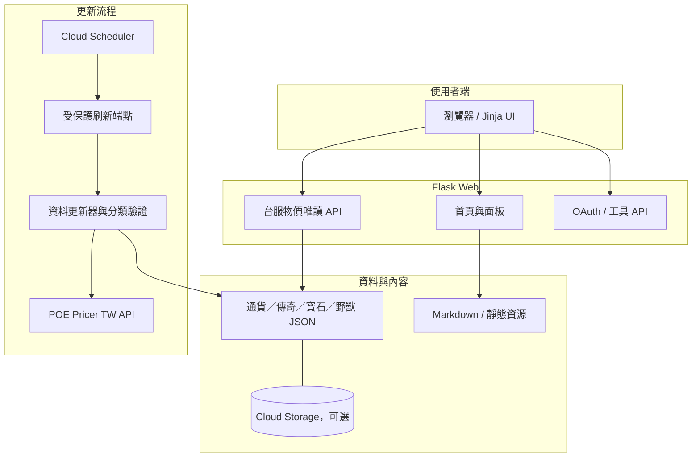
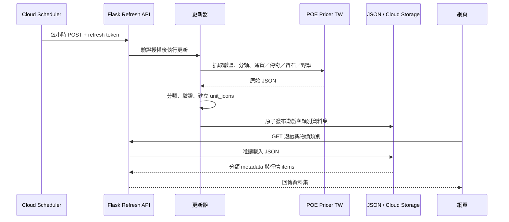

# Python Web（Flask）

本專案所有建構需遵循倉庫根目錄 [`PROJECT_RULES.md`](../PROJECT_RULES.md)；該文件是資料集、驗收、目錄與文件的核心規範。

## 目標

提供 PoE1／PoE2 繁體中文知識庫、工具與台服物價。行情由更新器同步成 JSON，網站只讀資料集，不在使用者查詢時連線抓取來源。

## 服務與模組

| 模組 | 責任 |
|---|---|
| Flask 首頁 | 分類導覽、Markdown 文件、PoE 工具與右側面板 |
| 台服物價更新器 | `monitor/tw_pricer/` 同步行情／完整名稱，驗證後發布 JSON |
| 台服物價 API | `monitor/tw_pricer/` 讀取已發布 JSON，不呼叫行情上游 |
| Cloud Scheduler | 每小時觸發受保護的資料刷新端點 |
.\scripts\start_local.ps1 -ClientId "你的 OAuth Client ID"
主要入口：`app.py`。`monitor/economy/` 管理 poe.ninja economy；`monitor/tw_pricer/` 管理台服資料集；`monitor/stash/` 管理私人倉庫領域。Jinja 頁面位於 `templates/`。

## 功能

- 首頁三欄知識庫，支援 POE1／POE2 分類、文章與策略密碼保護。
- POE1 甲蟲列為策略子項，與其他策略一起受密碼保護；舊 Filter 文章分類不再顯示，裝備／拓荒篩選工具維持可用。策略密碼來自 `STRATEGY_PASSWORD` 環境設定，不存 SQLite。
- 左側 POE1／POE2「物價」可折疊，分類有通貨、傳奇、寶石；POE1 另有野獸。各類依來源分類顯示圖示、中文名稱與筆數，選取後右側原地篩選。
- 價格以基準通貨圖示 → 物品圖示表示，另顯示趨勢、掛單數或信心資訊。
- 每筆價格旁提供另開的台服官方交易搜尋連結。
- 查價使用版本化官方名稱表，保留傳奇 name/type 與變異寶石 discriminator，帶入寶石等級／品質／腐化；缺少精確對照時不猜。`price: null` 不顯示歷史中位數為現價，有效價格始終保留文字單位。
- 更新器產生 POE1／POE2 × 通貨／傳奇／寶石，以及 POE1 野獸共七份 JSON；Cloud Run 多實例可共用私有 Cloud Storage。
- OAuth 倉庫同步、商店篩選及知識文件管理。
- 左側 POE1「倉庫統計」：官方 OAuth 私人倉庫、分頁／物品勾選、同聯盟資料集估值、分類占比與歷史快照；未知／稀有詞綴不假造價格。正式client、私有持久儲存與真實授權尚待設定，PoE2私人倉庫依官方限制停用。詳見 [`docs/STASH.md`](docs/STASH.md)。
- POE2 傳奇／寶石來源目前回傳空清單，狀態會顯示 unavailable；野獸行情目前只有 POE1 endpoint，不以其他遊戲或聯盟價格代替。

## 技術堆疊

- Python 3.11+、Flask、Jinja、Python-Markdown、Requests。
- JSON／本機 cache；Cloud Run 部署可使用 Google Cloud Storage 與 Cloud Scheduler。
- 自動化驗證使用 Python `unittest`。

## 架構與資料流程

### 系統架構



### 台服物價同步時序



## 專案結構

```text
web/
  app.py                  Flask routes / application assembly
  monitor/
    economy/              poe.ninja clients, leagues, translations
    stash/                private stash client, valuation, encrypted store
    tw_pricer/            Taiwan datasets, trade metadata and refresh
  scripts/                deploy, refresh, local startup and browser validation CLI
  docs/                   stash API, validation process and session handoff
  cache/                  generated JSON / local database cache
  content/<game>/<type>/  structured Markdown knowledge
  templates/              Jinja pages and panels
  static/                 images and static assets
  tests/
    unit/                 pricing, storage and domain logic tests
    integration/          Flask route and cross-layer tests
  drop_checker/           independent OCR price checker
  filter_gen/             independent item-filter generator
	Dockerfile, requirements*.txt, .env*  runtime/build configuration
```

完整目錄責任與資料契約見根目錄 `PROJECT_RULES.md`。

## 快速開始

在 `web/` 目錄執行：

```powershell
python -m venv .venv
.\.venv\Scripts\Activate.ps1
pip install -r requirements.txt
python app.py
```

開啟 `http://127.0.0.1:5000`；健康檢查為 `/health`。

OAuth 本機測試：

```powershell
.\scripts\start_local.ps1 -ClientId "你的 OAuth Client ID"
```

`-RedirectUri` 可選，預設使用目前 host／port 的 callback；如需改埠號加上 `-Port 5001`。

更新台服行情 JSON：

```powershell
python scripts/refresh_tw_currency.py
python -m unittest discover -s tests -v
```

僅同步兩版台服官方完整名稱／變體表，不修改行情價格：

```powershell
python scripts/refresh_tw_currency.py --trade-metadata-only
```

來源為 `https://pathofexile.tw/api/trade/data/items` 與 `/api/trade2/data/items`，每次同步各呼叫一次；遇到錯誤或空資料保留前一版。`web/cache/tw_trade_poe1.json`／`tw_trade_poe2.json` 是產生且納入版控的官方 metadata snapshot；使用與行情相同的 schema_version/game/kind/category/status/league/source/fetched_at/categories/items 契約，kind/category 為 `trade`、league 為 `global`，item 保存 type/name/text/disc/flags/category_id。Cloud Storage 沿用既有 `tw-currency/` prefix。

唯讀行情 API 依這份表附加 `trade_identity`（type、可選 name／discriminator）與 `trade_metadata_status`，不在 GET 抓官方 API；缺表、未知／歧義名稱的 identity 為 null，查價連結停用。未提供正式更新／排程授權時不修改線上排程。

每小時 Cloud Scheduler 與共享 Cloud Storage 設定：

```powershell
.\scripts\setup_tw_currency_scheduler.ps1 -BucketName "你的唯一 bucket 名稱" -RuntimeServiceAccount "Cloud Run 服務帳號"
```

此設定會修改線上 GCP 資源；依核心規範，須先取得使用者明確 OK 才能執行。部署 Cloud Run 必須先在執行環境驗證；當次明確要求「部署／佈署到 Cloud Run」即視為該次 OK，不需重複確認。

### 手機 GitHub Copilot 部署

專案指示位於 [`../.github/copilot-instructions.md`](../.github/copilot-instructions.md)。在手機要求「部署到 Cloud Run」時，Copilot 建立或更新 `.github/cloud-run-deploy-request.json`，並將部署請求與程式變更放在同一 PR。你核准並合併至 `main` 後，[部署工作流程](../.github/workflows/deploy-cloud-run.yml) 才會上線；GitHub 要求的人工核准不能靠對話授權省略。

- 沒有部署請求的普通 push／PR 不觸發部署。也可在 GitHub Actions 選擇 **Deploy Cloud Run → Run workflow → main** 手動部署。
- 工作流程先執行功能／契約測試，再建置 Docker 映像、檢查 `/health/ready` 並跑桌機／手機瀏覽器驗證。只有通過驗證的同一映像才會發布；部署前缺少策略密碼或固定 session key 時停止，部署後另驗 readiness。完整範圍與外部驗證限制見 [`docs/VALIDATION.md`](docs/VALIDATION.md)。
- 部署使用 GitHub OIDC 與 Google Cloud Workload Identity Federation，不使用長效金鑰、不沿用電腦上的 `gcloud` 登入。
- Google Cloud 信任限定本倉庫的 `main` 分支及指定部署工作流程；部署帳號僅能發布專用映像、更新既有服務並使用既有 runtime 身分。保留既有服務環境變數、Secret 與公開存取設定，不修改排程。
- 若授權尚未設定、Actions 尚未啟用或核准未完成，流程不能部署。成功後以 Actions 摘要的 commit、Cloud Run URL 與 `/health` 驗證結果為準；部署後健康檢查失敗不會自動回復舊 revision。
- 工作流程與 Copilot 指示必須先提交並推送到 GitHub 才會生效；本機檔案修改本身不會改變手機端行為。

2026-10-06 已設定的 Google Cloud 授權資源：

| 資源 | 設定 |
|---|---|
| OIDC provider | `projects/446879032144/locations/global/workloadIdentityPools/github-actions/providers/poe-web` |
| 信任條件 | `loyc1224/poe_web`、`refs/heads/main`、`.github/workflows/deploy-cloud-run.yml@refs/heads/main` |
| 部署帳號 | `poe-web-github-deploy@udata-gcp-1.iam.gserviceaccount.com` |
| 映像儲存庫 | `asia-east1-docker.pkg.dev/udata-gcp-1/poe-web-deploy`；僅此儲存庫的 `roles/artifactregistry.writer` |
| 服務權限 | 僅 `poe-python-web` 的 `roles/run.developer` |
| Runtime 使用權限 | 僅既有 `446879032144-compute@developer.gserviceaccount.com` 的 `roles/iam.serviceAccountUser` |

授權不需要新增 GitHub secret。第一次 GitHub 執行仍須驗證 OIDC 交換、映像發布與部署結果；設定授權不等於已完成端到端部署驗證。

## 文件索引

- 核心規範：[`../PROJECT_RULES.md`](../PROJECT_RULES.md)
- 目錄責任與功能查找：[`../REPOSITORY_MAP.md`](../REPOSITORY_MAP.md)
- 功能驗證程序、逐項矩陣與共用報告範本：[`docs/VALIDATION.md`](docs/VALIDATION.md)
- 個人倉庫統計、官方API限制與安全接入：[`docs/STASH.md`](docs/STASH.md)
- 延續作業摘要：[`docs/SESSION_HANDOFF.md`](docs/SESSION_HANDOFF.md)
- PoE2 篩選規格：`content/poe2/strategy/poe2-regex-filter-spec.md`
- POE1／POE2 物價資料 API：`/api/tw-pricer/<kind>?game=poe1|poe2`，kind 為 `currency`、`unique`、`gem`；`beast` 僅限 POE1

## Change Log

| 版本 | 日期 | 變更 |
|---|---|---|
| 1.2.0 | 2026-10-05 | 新增寶石與野獸 JSON 分類、放大側欄圖示、每筆台服交易搜尋連結，並擴充更新器與契約測試。 |
| 1.3.0 | 2026-10-05 | 移除開季監控頁／API 及 POE1／POE2 快速交易面板，保留物價與倉庫查價流程。 |
| 1.3.1 | 2026-10-06 | 明確部署指令視為當次 OK，新增手機 Copilot 部署請求與無金鑰 GitHub Actions 部署流程。 |
| 1.3.2 | 2026-10-06 | 修正首次 icon、策略邊界、剪貼簿錯誤與 SQLite 清理；新增 readiness、逐項瀏覽器驗收與共用驗證範本。 |
| 1.3.3 | 2026-10-06 | 移除舊 Filter 入口，甲蟲整合為受保護的策略子項，補上子項解鎖回歸與密碼儲存說明。 |
| 1.3.4 | 2026-10-06 | 修正歷史估價誤當現價與單位缺漏；新增官方 trade／trade2 名稱表、變體精確查詢及真實公開掛單驗證程序。 |
| 1.4.0 | 2026-10-06 | 新增PoE1倉庫統計入口、官方私倉客戶端、加密帳號隔離、資料集估值／選取／快照，補回歸與真實OAuth阻礙說明。 |
| 1.4.1 | 2026-10-06 | 倉庫模組歸類與目錄索引，連結帳號恢復官方OAuth導航並補原頁錯誤返回驗證。 |
| 1.5.0 | 2026-10-06 | 行情與 economy 模組依領域歸包；測試分 unit／integration，更新引用及查找索引。 |
| 1.6.0 | 2026-10-06 | 將操作腳本與專用文件分別歸入 scripts/、docs/，更新 CI、操作命令及文件連結。 |
