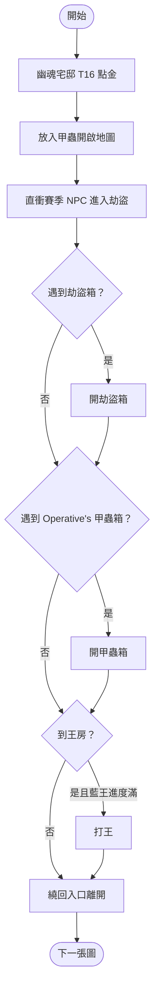

# 甲蟲 × 幽魂宅邸（劫盜箱）策略

## 策略核心
- 地圖選擇 **幽魂宅邸** T16，點金後放入甲蟲開啟。
- 直衝賽季 NPC 進入劫盜副本，**不打周圍怪物、不開劫盜或一般箱子**。
- 目標只有兩項：**劫盜箱** 和 **甲蟲箱（Operative's Strongbox）**。
- 王房可打；繞回入口後直接離開，除非藍王進度已滿才順手清王。
- 目標節奏：**一張圖 1.5 分鐘高效率打完**。

## 甲蟲配置
- 聖甲蟲：伏擊 ×3
- 聖甲蟲：暗室伏擊 ×1
- 聖甲蟲：爆發伏擊 ×1

## 與圖天賦

- 以劫盜與保險箱相關節點為主，目標是提高箱子數量與箱子價值。
- 路線優先確保跑圖順暢，避免繞遠路影響每張圖 1.5 分鐘節奏。

## 收益來源

### 主要收益
1. **高中價聖甲蟲** — 低價甲蟲 3 換 1（見下方估價截圖）。
2. **劫盜藍圖** — 盡量只出通貨甲蟲藍圖和只出實驗藍圖（記得去交易所查詢藍圖當前售價再決定是否交換）。
3. **藍王門票** — 打王後觸發。
4. **其他額外掉落** — 甲蟲箱可能出現其他高價通貨。

> 個人實測：每小時平均收益 **25D+**，一天多穩定賺 **300D 左右**。

### 甲蟲估價參考

| 顏色框 | 大約價值 |
|--------|---------|
| 紅框   | 百 c 上下 |
| 黃框   | 10c 左右  |
| 白框   | 1c 以上   |

> 低價甲蟲收集後記得 **3 換 1**，不要直接賣單顆。

## 優缺點

### 優點
- 高收益、**基本 0 投資**（甲蟲地圖多半能自產）。
- 連續打圖不中斷率 **70% 以上**（自產甲蟲數量通常夠用）。

### 缺點
- 角色必須能扛住甲蟲箱開啟後的 **冰霜、屍爆傷害**。
- 最好有**迷蹤（Phasing）** 狀態，方便在怪群中穿梭閃避。

## 運作流程

