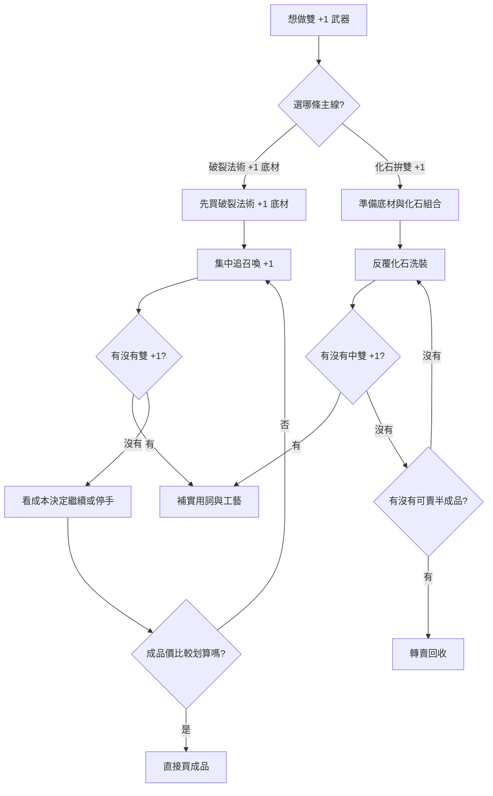

# 做裝：召喚 +1 / 法術 +1 武器

## 先講結論
- 這個做裝**非常吃機率**，不是那種「照流程就很容易出」的項目。
- 如果沒有先考慮機率，很多看起來合理的做法，實際上都會變成燒大量通貨卻做不出來。
- 你實做過的方向比較正確：
  - **直接用破裂法術 +1 底材**，會比從零開始亂洗實際很多。
  - 另外，**用化石去拚雙 +1**，整體上也會比一些一般亂點做法更有機會。
- 就算如此，這項目本質上仍然是**難做、低機率、高波動**。

## 核心目標
- 目標是做出一把同時帶有：
  - **召喚技能石等級 +1**
  - **所有法術技能石等級 +1**
  的武器。
- 最理想狀態不是只有雙 +1，還要留有後續可以補的實用詞綴空間。

## 為什麼原本那種做法不實用
- 因為真正的難點不是「知道要雙 +1」，而是：
  - 你怎麼把其中一條固定住
  - 你怎麼在低機率下追另一條
  - 你怎麼避免洗到整把報廢
- 如果沒有破裂底或提高命中率的手段，很多做法都只是理論上能做，實際上不夠實用。

## 實用做法一：破裂法術 +1 底材
這條通常是最實際的主線。

### 核心概念
- 直接買一把**破裂：所有法術技能石等級 +1** 的底材。
- 這樣你至少先把最重要的一條固定住。
- 後面就只需要專心想辦法補出 **召喚 +1**。

### 為什麼這條最實用
- 因為 `法術 +1` 本身就是很關鍵而且很難穩定保留的詞。
- 破裂後，這條就不會掉。
- 你後面在洗裝時，整體風險會小非常多。

### 流程
1. 先買**破裂法術 +1** 的底材。
2. 確認底材類型是你要的武器基底。
3. 用你能接受的方式去追 **召喚 +1**。
4. 出到雙 +1 後，再看剩下空間補：
   - 召喚物傷
   - 施法速度
   - 觸發工藝
   - 其他實用詞

### 優點
- 最務實。
- 至少先鎖住一條核心詞。
- 後續做裝方向比較清楚。

### 缺點
- 破裂底通常不便宜。
- 即使如此，補第二條 `召喚 +1` 仍然不好做。
- 本質還是低機率項目。

## 實用做法二：化石拚雙 +1
你提到的這條也應該放進來，因為它確實比很多普通洗法更有機會。

### 核心概念
- 利用**化石**去縮小詞池、提高命中雙 +1 的機率。
- 這不是保證成功，但比單純亂洗更接近可操作方案。

### 為什麼比較好
- 因為化石能幫你把部分不想要的詞池壓掉。
- 在追雙 +1 這種本來就很低機率的目標時，任何能縮詞池的方法都很重要。
- 所以從實際做裝角度來看，化石法比很多表面上便宜、實際上亂燒的做法更有價值。

### 流程
1. 準備好你要的武器底材。
2. 使用適合召喚／法術方向的化石組合。
3. 反覆洗到出現：
   - `法術 +1`
   - `召喚 +1`
4. 如果只中單條關鍵詞，再決定是否繼續追、轉半成品賣掉、或停手。

### 優點
- 在追雙 +1 這件事上，通常比一般亂洗更有機率。
- 若你熟悉化石組合，會比盲洗穩得多。
- 也有機會在過程中洗出能賣的半成品。

### 缺點
- 仍然是低機率。
- 需要持續投入化石與底材。
- 很容易洗很多次還是只看到單 +1 或雜詞。

## 兩條做法怎麼選
- **你要穩一點、實戰一點**：選 **破裂法術 +1 底材**。
- **你要自己拚、靠詞池提高機率**：選 **化石拚雙 +1**。
- **你預算高又不想自己賭**：很多時候直接買成品會更省。

## 機率觀念
- 這篇最重要的不是某個固定通貨流程，而是要先接受：
  - **雙 +1 本來就是低機率目標**
  - **不是每一條看起來能做的流程都值得做**
- 所以判斷標準應該是：
  1. 能不能先固定一條核心詞
  2. 能不能縮詞池
  3. 洗失敗後損失大不大
  4. 最終成本有沒有超過成品價格

## 成本觀念
- 這篇沒有像支配者之玉那種單一明確價格按鈕，但真正成本常常來自：
  - 高價破裂底
  - 大量化石
  - 洗很多輪都沒中
  - 做到一半變成只能賣半成品回收
- 所以你在這類做裝上，要先算的不是「單次花費」，而是：
  - **整體預算上限**
  - **你願不願意承受低機率**
  - **做不出來時能不能回收**

## 實戰建議
- 如果你只是想要一把能玩的武器：
  - 先買單 +1 可用武器，通常最舒服。
- 如果你真的要追雙 +1：
  - **破裂法術 +1 底材** 是比較實際的出發點。
- 如果你很熟化石、也接受失敗：
  - 可以走**化石拚雙 +1**。
- 如果市場上雙 +1 成品價格已經接近你自己做的總預算：
  - **直接買成品通常比較合理**。

## 流程圖

## 一句話總結
- **雙 +1 很難做，先固定核心詞或先縮詞池，才是實用做法。**
- 以實戰來說，**破裂法術 +1 底材**與**化石拚雙 +1**，都比原本那種空泛流程更實用。
