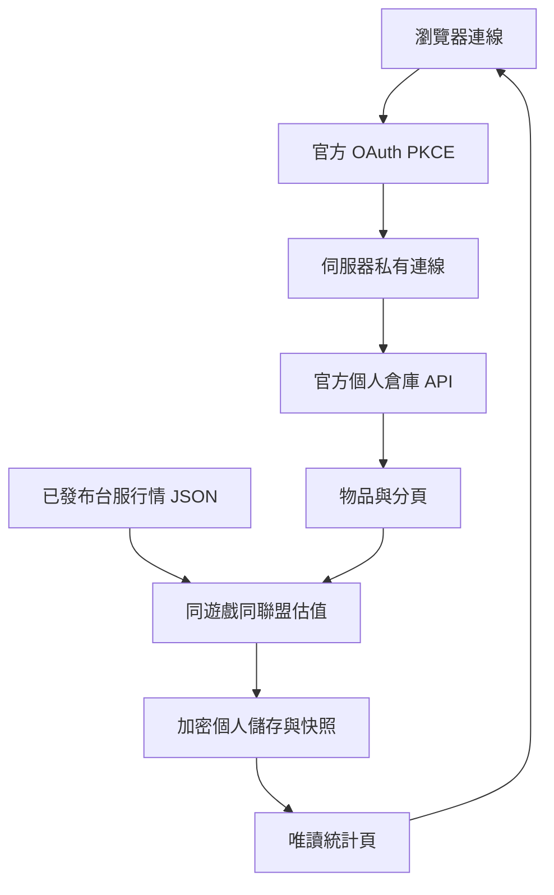

# 倉庫統計：資料流程與接入

遵循 [專案核心規範](../../PROJECT_RULES.md) 及 [共用驗證程序](VALIDATION.md)。

## 研究結果

參考 [PoE Pricer TW 倉庫頁](https://www.poepricer.com/stash) 的公開操作：分頁／物品勾選、總估值、分類占比、歷史快照、搜尋與同步。公開頁與截圖不能證明其私有後端或估價演算法；本站沒有讀取對方會員倉庫、複製其私有 API 或借用其 OAuth client。

官方文件：[OAuth 2.1](https://www.pathofexile.com/developer/docs/authorization)、[私人倉庫 API](https://www.pathofexile.com/developer/docs/reference#stashes)。2026-10-06 文件明列私人倉庫為 **PoE1 only**；PoE2 選項因此停用，不猜不存在的端點。

## 實作範圍

- 首頁左側 POE1「倉庫統計」開啟 `/stash`。
- 分頁／物品勾選、物品搜尋／排序、分類占比、總估值、7／30／90 天同選取範圍快照與按實際間隔計算的每小時變化。
- 明確按「同步估值」才讀官方帳號；自動同步預設關閉，啟用後每 15 分鐘嘗試一次，出錯即停止。未設定 OAuth 時不啟用按鈕。
- 「連結帳號」始終為可點擊的官方OAuth動作，經本站 `/api/pricer/oauth/start` 302至官方頁，不由前端攔截。齒輪另顯示設定存在布林；沒有本站註冊client時，後端回到原倉庫頁報缺漏，不借用別人的client、不偽造登入成功。
- 官方原始物品以 stackSize、名稱、寶石等級／品質／腐化對照本站已發布價格。價格只能來自同遊戲、同聯盟 JSON；不在網頁 GET 即時抓行情。
- 只有有有效價格的物品計入 Divine 估值。稀有詞綴裝備、未知名稱、未鑑定傳奇、缺失／unavailable 行情維持未估價，不能當零價、歷史 median 或隨意估價。
- 傳奇是名稱級參考估值，**不是**特定配值／插槽／貼膜溢價的精準估價；這些差異仍需人工交易比較。官網 API 不直接提供經濟價值。
- 巢狀分頁與 socketedItems 都納入，依官方物品 ID 去重；缺 ID 的勾選只對目前快照有效，下次同步清除，避免排除錯位物品。

## 責任與資料流

| 模組 | 責任 |
|---|---|
| `app.py` | OAuth PKCE、session 連線識別、API 協調、同源寫入與錯誤邊界 |
| `monitor/stash/client.py` | 官方 `/profile`、`/stash/{league}`、`/stash/{league}/{id}`／子分頁讀取 |
| `monitor/stash/pricer.py` | 純函式估值、分頁／物品選取、未知資料與去重 |
| `monitor/stash/store.py` | 按連線隔離，Fernet 加密 token、原始倉庫、選取與快照 |
| `templates/stash.html` | 狀態、控制、圖表、物品表，沒有內建示範資產 |



## API 契約

| API | 行為 |
|---|---|
| `GET /api/stash/state` | 本瀏覽器連線狀態、設定缺漏、估值、選取、同遊戲／聯盟／選取範圍的快照；不回傳 token |
| `POST /api/stash/sync` | JSON `{game: "poe1", league: "聯盟"}`，有授權才取官方資料，完成後原子替換快照 |
| `POST /api/stash/selection` | JSON `{selected_tabs: [id], excluded_items: [id]}`，只重估已同步物品；外來 ID 拒絕 |
| `POST /api/stash/disconnect` | JSON `{}`，刪除本連線儲存與識別；不修改遊戲倉庫 |

寫入需 JSON 物件；有 Origin 時需同站。Cookie 是 HTTP-only／SameSite=Lax，Cloud Run 為 Secure。倉庫 API 與頁面使用 `private, no-store`。

401 代表未授權／失效，403 scope 不足，409 不支援遊戲或聯盟行情不符，429 官方限流，502 官方格式／連線異常，503 正式持久儲存缺漏。出錯不寫零資產或覆蓋最後有效快照；限流不能自行密集重試。

舊 `/pricer` 的倉庫區沿用相同私有資料與估值，`GET resources?refresh=1` 僅重估快取，不觸發官方同步。舊全站單筆 SQLite token／倉庫不自動迁移，避免無法判定所有者的資料外洩，使用者需重新授權。

## 真實遊戲接入前提

**2026-10-06 本站接入狀態：BLOCKED，申請等待官方回覆。** 國際服 [GGG Getting Started](https://www.pathofexile.com/developer/docs/index#gettingstarted) 明列目前無法處理新應用申請，**不能直接推論台服也暫停**。使用者提供台服 PoEDB／poeTwPricer 的授權紀錄，證明台服既有OAuth應用存在；紀錄沒有核發日期，不能推定是最近新申請。使用者已表示本站 OAuth 申請已送出，尚未取得核准或正式client資料。台服 [官方客服](https://pathofexile.tw/support) 與 [應用管理](https://pathofexile.tw/my-account/applications) 可進一步確認，管理頁需本人登入。

client ID／secret 必須由官方核發，不能由Cloud Run產生、拿fixture替代或借用其他網站的應用。授權給PoEDB／poeTwPricer只是允許它們讀取自己的遊戲資料，不代表自己擁有其client憑證或可替本站登記回呼。需向台服官方確認本站的confidential client申請、Cloud Run回呼是否可登記，以及支援的授權／私人倉庫API端點。

站台已選定現有Cloud Run，回呼固定為 `https://poe-python-web-446879032144.asia-east1.run.app/callback`。已確認HTTPS路由存在（無授權請求回302），並在未追蹤本機 `.env` 設定 `POE_TW_REDIRECT_URI`。**這不代表 client已註冊、官方已核准回呼、或正式Cloud Run已配置OAuth值**；正式配置／Secret／私有bucket與部署仍待可用client及當次授權，不能因只填回呼就宣稱登入完成。

1. 等待官方回覆申請；若核准，使用官方核發、屬於本站的 **confidential OAuth client**，確認 HTTPS 回呼可登記；不可沿用 PoEPricer 的 client。
2. 授權範圍為 `account:profile account:stashes`，登入完全由官方處理。本站不收遊戲密碼、不收 POESESSID。
3. 安全設定 `POE_TW_CLIENT_ID`、`POE_TW_CLIENT_SECRET`、`POE_TW_REDIRECT_URI`。client secret 與固定 `FLASK_SECRET_KEY` 使用 Secret Manager／未追蹤 `.env`，不放對話、命令參數或版控。
4. 正式 Cloud Run 必須配置私有 GCS `STASH_STORAGE_BUCKET`，runtime 僅有該 bucket 的必要物件權限。沒有持久儲存時禁止正式同步；本機用加密 SQLite。
5. 確認台服註冊 client、授權伺服器與官方 `api.pathofexile.com` 的帳號／realm 相容；**此區域端到端流程尚未經真實授權驗證**，不能因 fixture 通過就宣稱能讀到台服遊戲。
6. 正式行情聯盟必須與同步的聯盟一致，透過合法明確更新／排程維持資料集。官方對每個 client 有呼叫限制，需依其政策調整同步範圍與頻率。

加密使用固定 Flask secret 派生、帶用途分隔的 Fernet key；輪替 secret 會使既有 token／倉庫無法解密，正式輪替前須規劃重新授權或密鑰迁移。每個瀏覽器有獨立連線 ID；同一帳號在其他裝置需另授權，不假裝自動跨裝置共享。

### 台服申請途徑查詢與客服範本

2026-10-06 查核：台服公開 [客服頁](https://pathofexile.tw/support) 有聯繫客服／登入驗證碼入口；尚未找到台服公開OAuth註冊表單或核發規則。台服 `/developer/docs/index` 與 `/developer/docs/authorization` 回404；這只能證明該文件路徑不可用，不能證明台服不受理申請。使用者已表示本站申請送出，等待官方回覆；我們沒有代登入帳號或查看私人應用管理頁。以下範本只在官方要求補件或需追問時使用：

```text
主旨：補充本站台服 OAuth client 申請資料與私人倉庫 API 詢問

您好，我已為自己的「POE 知識庫」網站提交台服 OAuth client 申請，想確認申請狀態及以下技術事項。
網站：https://poe-python-web-446879032144.asia-east1.run.app/
用途：玩家經官方登入授權後，唯讀取得自己的倉庫及道具，計算倉庫資產統計。
本網站不收取遊戲密碼或 POESESSID；授權憑證只在伺服器端加密保存。
預計類型：confidential web client，Authorization Code + PKCE。
預計最小權限：account:profile、account:stashes，請確認台服正式支援的 scope。
預計回呼：https://poe-python-web-446879032144.asia-east1.run.app/callback

請問目前是否受理新的台服 OAuth client？正式申請窗口、流程與必備資料為何？
此 Cloud Run HTTPS 網址能否登記為回呼？是否必須使用自己持有的自訂網域？
請提供台服授權／token／私人倉庫 API 的正式文件，並確認 PoE1／PoE2 支援範圍與呼叫限制。
謝謝。
```

依官方回覆補齊申請資料後再申請；不要將未知核發流程描述為已確認的客服核發機制。密碼、client secret 或 token 不放客服範本、公開論壇或對話。

## 驗收與狀態

```powershell
python -m pip install -r requirements.txt -r requirements-validation.txt
python -m playwright install chromium
python -m unittest discover -s tests -v
python scripts/validate_site.py --report "$env:TEMP\poe-site-validation-stash.json"
```

先前倉庫功能已通過本機與 Python 3.11／gunicorn 容器的45項離線測試及20項桌機／手機核心檢查。本輪目錄歸類與OAuth導覽補至48項離線回歸，新增官方302／PKCE／scope／Secret不出URL、缺設定與交換失敗回原頁；真實client仍未設定，因此不把fixture跳轉當作實際官方授權成功。目錄責任與查找位置見 [`../../REPOSITORY_MAP.md`](../../REPOSITORY_MAP.md)。

UI 不植入 demo 資產；未連結時總值是 `—`。倉庫介面已部署至 `poe-python-web-00044-gd4`；因台服 OAuth client 尚待官方核發，真實授權／同步仍 BLOCKED。本次未建立或修改線上排程。測試JSON／截圖在系統 TEMP `poe-site-validation-stash-container.json`／同名目錄。

## 變更紀錄

| 版本 | 日期 | 內容 |
|---|---|---|
| 1.0.0 | 2026-10-06 | 新增左側倉庫統計、資料集估值、分頁／物品選取、快照與加密私有連線，記錄官方PoE1限制及真實授權前提。 |
| 1.0.1 | 2026-10-06 | 倉庫模組歸類；連結帳號恢復直接官方OAuth流程、診斷用獨立齒輪，補跳轉與錯誤返回回歸。 |
| 1.0.2 | 2026-10-06 | 記錄台服 OAuth 申請已送出待回覆及倉庫程式／文件目錄整理狀態。 |
| 1.0.3 | 2026-10-06 | 記錄倉庫介面部署至 `00044-gd4`；真實 OAuth 同步仍 BLOCKED，未修改排程。 |