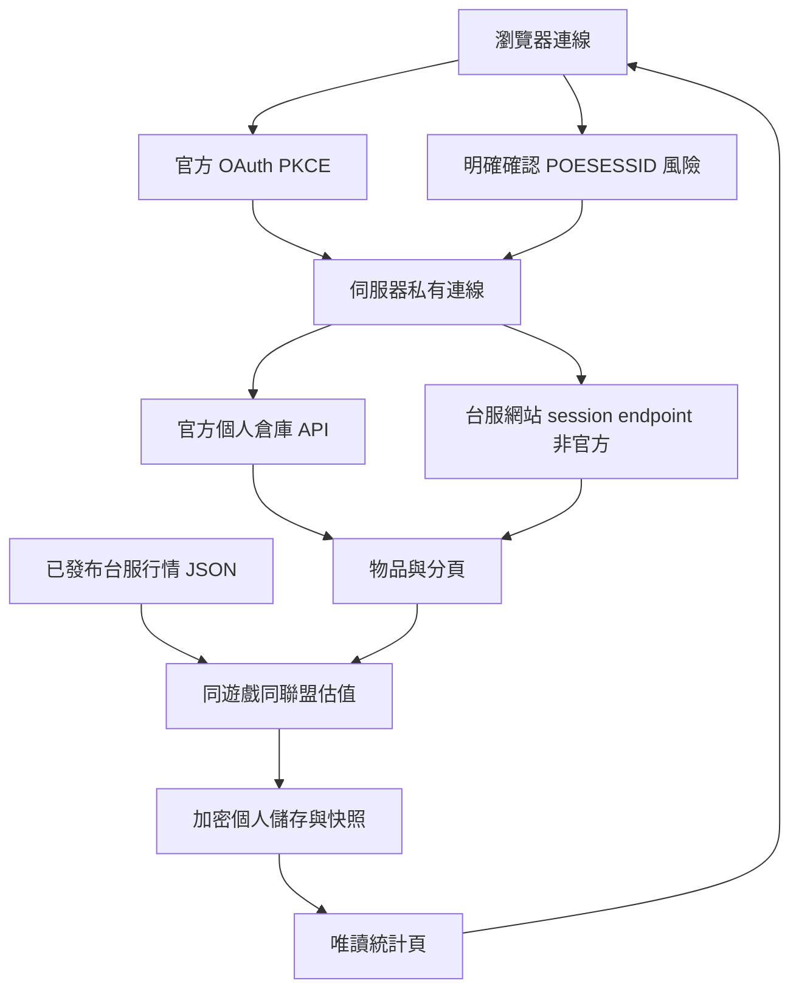

# 倉庫統計：資料流程與接入

遵循 [專案核心規範](../../PROJECT_RULES.md) 及 [共用驗證程序](VALIDATION.md)。

## 研究結果

參考 [PoE Pricer TW 倉庫頁](https://www.poepricer.com/stash) 的公開操作：分頁／物品勾選、總估值、分類占比、歷史快照、搜尋與同步。公開頁與截圖不能證明其私有後端或估價演算法；本站沒有讀取對方會員倉庫、複製其私有 API 或借用其 OAuth client。

官方文件：[OAuth 2.1](https://www.pathofexile.com/developer/docs/authorization)、[私人倉庫 API](https://www.pathofexile.com/developer/docs/reference#stashes)。2026-10-06 文件明列私人倉庫為 **PoE1 only**；PoE2 選項因此停用，不猜不存在的端點。

官方 [Getting Started](https://www.pathofexile.com/developer/docs/index#gettingstarted) 要求先註冊應用，並限定只能呼叫文件列出的 API；國際站目前暫停受理新應用，不能直接推論台服政策。公開實作方面，[pobb.in](https://github.com/Dav1dde/pasteofexile) 的 server-side OAuth 使用自己的 client ID／secret、callback 與官方格式 User-Agent；[Exilence Next](https://github.com/viktorgullmark/exilence-next) 是桌面程式，用自己的 client ID 與桌面 callback。這兩者是官方 OAuth client 模式。

另找到 [takeitexile/exile-tools](https://github.com/takeitexile/exile-tools)：它同時提供官方 OAuth 桌面模式，以及玩家提供 POESESSID 的 session 模式。依使用者明確要求，本站也提供 session-cookie 連線；這是非官方相容模式，呼叫未列於官方 reference 的 `character-window/get-stash-items`，可能違反 GGG API／Terms of Use 政策、可能失效。它不會被標示成官方 OAuth，也不會在未勾選明確同意時接收 cookie。

## 實作範圍

- 首頁左側 POE1「倉庫統計」開啟 `/stash`。
- 分頁／物品勾選、物品搜尋／排序、分類占比、總估值、7／30／90 天同選取範圍快照與按實際間隔計算的每小時變化。
## OAuth 真實遊戲接入前提
- OAuth 設定完整時「連結帳號」經本站 `/api/pricer/oauth/start` 302至官方頁。未設定時開啟 session-cookie 對話框，要求帳號名稱、32 位 POESESSID 與風險確認；只有確認才 POST 到本站。
- session-cookie 只呼叫固定台服 host／endpoint、僅 PoE1，保存在使用者隔離的 Fernet 加密 store；不進 URL、瀏覽器儲存、API 回應或日誌。無效／過期時清除 session 憑證，斷開時刪除所有本站私有倉庫資料。Session cookie 是完整登入憑證，本站營運者可接觸伺服器，玩家必須自行評估風險。
- OAuth 同意只授權 URL 中指定的應用，不會把該應用的 client ID／secret 或 token 授予本站。`client_id=poetwpricer` 的回呼固定是 `https://www.poepricer.com/callback`；即使玩家已授權 poepricer，也不能改成本站 callback 或由本站交換其授權碼。本站須使用官方核發給本站的 client 與已登記回呼。
- Cloud Run 網站使用 confidential client、HTTPS 註冊 callback、Authorization Code + PKCE 與最小 scope `account:profile account:stashes`；client secret 留在伺服器端。Public client 即使不需 secret，仍必須有自己的註冊 client ID，且官方限定 localhost callback，不能用於此 Cloud Run 網站。
## POESESSID Session 連線

依使用者明確要求提供的相容模式：使用者在本站對話框自行輸入 PoE 帳號名稱及 32 位十六進位 POESESSID，勾選風險確認後送出。本站僅接受固定 `pathofexile.tw` host 的 `character-window/get-stash-items` 請求，不允許自訂 host／路徑／Cookie 名；最多讀取 256 個分頁，請求不自動重新導向。此 endpoint 未列於官方 API reference，不是官方 OAuth，可能隨時失效且可能違反 GGG API／Terms of Use 政策。

POESESSID 等同完整登入 session，伺服器可代表該帳號存取網站功能。本站只在取得明確勾選後透過同站 POST 接收，按瀏覽器連線隔離並以 Fernet 加密保存；不放在 URL、瀏覽器持久儲存、回應或應用日誌。OAuth 成功連結會替換 session-cookie 憑證；任何模式的「斷開帳號」都刪除該瀏覽器連線的加密憑證與 stash 快照。Session 失效收到 401／403 時清除 session 憑證並保留最後有效估值。

Session 模式由使用者自行選擇並承擔第三方服務與帳號 session 風險；未實際使用本人有效 cookie 完成成功 roundtrip 前，不可把 fixture 標成真實連線 PASS。正式使用須以 HTTPS、固定 `FLASK_SECRET_KEY` 與私有 `STASH_STORAGE_BUCKET`；不要在聊天、Issue、截圖或文件貼出 POESESSID。
- Token exchange 明確送出授權 scope、同一 callback 與 PKCE verifier；token 交換與倉庫 API 請求均使用 `OAuth <client_id>/<version> (contact: <contact>)` User-Agent。本站 contact 指向公開 repository issue tracker。
- 官方原始物品以 stackSize、名稱、寶石等級／品質／腐化對照本站已發布價格。價格只能來自同遊戲、同聯盟 JSON；不在網頁 GET 即時抓行情。
- 只有有有效價格的物品計入 Divine 估值。稀有詞綴裝備、未知名稱、未鑑定傳奇、缺失／unavailable 行情維持未估價，不能當零價、歷史 median 或隨意估價。
| 1.0.8 | 2026-10-07 | 依使用者要求加入 opt-in POESESSID session 連線、固定台服 endpoint、加密保存與明確風險同意；55 tests PASS、桌機／手機 20 PASS，真實 OAuth／session 各 BLOCKED。 |
- 傳奇是名稱級參考估值，**不是**特定配值／插槽／貼膜溢價的精準估價；這些差異仍需人工交易比較。官網 API 不直接提供經濟價值。
- 巢狀分頁與 socketedItems 都納入，依官方物品 ID 去重；缺 ID 的勾選只對目前快照有效，下次同步清除，避免排除錯位物品。

## 責任與資料流

| 模組 | 責任 |
|---|---|
| `app.py` | OAuth PKCE、session 連線識別、API 協調、同源寫入與錯誤邊界 |
| `monitor/stash/client.py` | 官方 `/profile`、`/stash/{league}`、`/stash/{league}/{id}`／子分頁讀取 |
| `monitor/stash/pricer.py` | 純函式估值、分頁／物品選取、未知資料與去重 |
| `monitor/stash/store.py` | 按連線隔離，Fernet 加密 token、原始倉庫、選取與快照 |
| `templates/stash.html` | 狀態、控制、圖表、物品表，沒有內建示範資產 |



## API 契約

| API | 行為 |
|---|---|
| `GET /api/stash/state` | 本瀏覽器連線狀態、設定缺漏、估值、選取、同遊戲／聯盟／選取範圍的快照；不回傳 token |
| `POST /api/stash/session/connect` | JSON `{account_name, poe_session, game, league, accepted_risk: true}`；明確同意後測試並加密保存 session、同步倉庫；不在回應回傳 session |
| `POST /api/stash/sync` | JSON `{game: "poe1", league: "聯盟"}`，按連線模式讀取資料，完成後保存估值快照 |
| `POST /api/stash/selection` | JSON `{selected_tabs: [id], excluded_items: [id]}`，只重估已同步物品；外來 ID 拒絕 |
| `POST /api/stash/disconnect` | JSON `{}`，刪除本連線儲存與識別；不修改遊戲倉庫 |

寫入需 JSON 物件；有 Origin 時需同站。Cookie 是 HTTP-only／SameSite=Lax，Cloud Run 為 Secure。倉庫 API 與頁面使用 `private, no-store`。

401 代表 OAuth／session 無效，403 OAuth scope 不足，409 不支援遊戲或聯盟行情不符，429 上游限流，502 上游格式／連線異常，503 正式持久儲存缺漏。出錯不寫零資產或覆蓋最後有效快照；限流不能自行密集重試。

舊 `/pricer` 的倉庫區沿用相同私有資料與估值，`GET resources?refresh=1` 僅重估快取，不觸發官方同步。舊全站單筆 SQLite token／倉庫不自動迁移，避免無法判定所有者的資料外洩，使用者需重新授權。

## 真實遊戲接入前提

**2026-10-07 官方 OAuth 狀態：BLOCKED，本站沒有已配置的 OAuth client。** 國際服 [GGG Getting Started](https://www.pathofexile.com/developer/docs/index#gettingstarted) 明列目前無法處理新應用申請，**不能直接推論台服也暫停**。使用者提供台服 PoEDB／poeTwPricer 的授權紀錄，證明台服既有 OAuth 應用存在；玩家授權清單不是 client 建立頁。使用者已登入台服帳號並確認「管理申請」僅顯示已授權應用，沒有建立 client 入口；台服註冊流程仍未公開確認。Session-cookie connector 已實作，但真實帳號 roundtrip 尚未驗證。

client ID／secret 必須由官方核發，不能由Cloud Run產生、拿fixture替代或借用其他網站的應用。授權給PoEDB／poeTwPricer只是允許它們讀取自己的遊戲資料，不代表自己擁有其client憑證或可替本站登記回呼。使用者提供的 poepricer 授權 URL 使用 `client_id=poetwpricer`、回呼 `https://www.poepricer.com/callback`；這只驗證 poepricer 自己的 OAuth 流程，並不提供本站可用的應用憑證。需向台服官方確認本站的confidential client申請、Cloud Run回呼是否可登記，以及支援的授權／私人倉庫API端點。

站台已選定現有Cloud Run，OAuth 回呼固定為 `https://poe-python-web-446879032144.asia-east1.run.app/callback`。已確認 HTTPS 路由存在（無授權請求回 302），並在未追蹤本機 `.env` 設定 `POE_TW_REDIRECT_URI`。**這不代表 client 已註冊、官方已核准回呼、或正式 Cloud Run 已配置 OAuth 值**；OAuth 正式配置／Secret／私有 bucket 與部署仍待可用 client 及當次授權。Session-cookie 模式不使用此 callback，但 Cloud Run 同樣需要私有 bucket；真實 POESESSID roundtrip 尚未驗證，不能宣稱正式同步成功。

1. 等待官方回覆申請；若核准，使用官方核發、屬於本站的 **confidential OAuth client**，確認 HTTPS 回呼可登記；不可沿用 PoEPricer 的 client。
2. OAuth 模式授權範圍為 `account:profile account:stashes`，登入由官方處理且不收遊戲密碼；POESESSID 只供使用者主動選擇的 session-cookie 模式，不與 OAuth 混用。
3. 安全設定 `POE_TW_CLIENT_ID`、`POE_TW_CLIENT_SECRET`、`POE_TW_REDIRECT_URI`。client secret 與固定 `FLASK_SECRET_KEY` 使用 Secret Manager／未追蹤 `.env`，不放對話、命令參數或版控。
4. 正式 Cloud Run 必須配置私有 GCS `STASH_STORAGE_BUCKET`，runtime 僅有該 bucket 的必要物件權限。沒有持久儲存時禁止正式同步；本機用加密 SQLite。
5. 確認台服註冊 client、授權伺服器與官方 `api.pathofexile.com` 的帳號／realm 相容；**此區域端到端流程尚未經真實授權驗證**，不能因 fixture 通過就宣稱能讀到台服遊戲。
6. 正式行情聯盟必須與同步的聯盟一致，透過合法明確更新／排程維持資料集。官方對每個 client 有呼叫限制，需依其政策調整同步範圍與頻率。

加密使用固定 Flask secret 派生、帶用途分隔的 Fernet key；輪替 secret 會使既有 token／倉庫無法解密，正式輪替前須規劃重新授權或密鑰迁移。每個瀏覽器有獨立連線 ID；同一帳號在其他裝置需另授權，不假裝自動跨裝置共享。

### 台服申請途徑查詢與客服範本

2026-10-06 查核：台服公開 [客服頁](https://pathofexile.tw/support) 有聯繫客服／登入驗證碼入口；尚未找到台服公開OAuth註冊表單或核發規則。台服 `/developer/docs/index` 與 `/developer/docs/authorization` 回404；這只能證明該文件路徑不可用，不能證明台服不受理申請。使用者已表示本站申請送出，等待官方回覆；我們沒有代登入帳號或查看私人應用管理頁。以下範本只在官方要求補件或需追問時使用：

```text
主旨：補充本站台服 OAuth client 申請資料與私人倉庫 API 詢問

您好，我已為自己的「POE 知識庫」網站提交台服 OAuth client 申請，想確認申請狀態及以下技術事項。
網站：https://poe-python-web-446879032144.asia-east1.run.app/
用途：玩家經官方登入授權後，唯讀取得自己的倉庫及道具，計算倉庫資產統計。
OAuth 模式不收取遊戲密碼或 POESESSID；OAuth 憑證只在伺服器端加密保存。另有獨立 opt-in session-cookie 模式，其風險與處理方式見上方說明。
預計類型：confidential web client，Authorization Code + PKCE。
預計最小權限：account:profile、account:stashes，請確認台服正式支援的 scope。
預計回呼：https://poe-python-web-446879032144.asia-east1.run.app/callback

請問目前是否受理新的台服 OAuth client？正式申請窗口、流程與必備資料為何？
此 Cloud Run HTTPS 網址能否登記為回呼？是否必須使用自己持有的自訂網域？
請提供台服授權／token／私人倉庫 API 的正式文件，並確認 PoE1／PoE2 支援範圍與呼叫限制。
謝謝。
```

依官方回覆補齊申請資料後再申請；不要將未知核發流程描述為已確認的客服核發機制。密碼、client secret 或 token 不放客服範本、公開論壇或對話。

## 驗收與狀態

```powershell
python -m pip install -r requirements.txt -r requirements-validation.txt
python -m playwright install chromium
python -m unittest discover -s tests -v
python scripts/validate_site.py --report "$env:TEMP\poe-site-validation-stash.json"
```

先前倉庫功能已通過本機與 Python 3.11／gunicorn 容器的45項離線測試及20項桌機／手機核心檢查。本輪目錄歸類與OAuth導覽補至48項離線回歸，新增官方302／PKCE／scope／Secret不出URL、缺設定與交換失敗回原頁；真實client仍未設定，因此不把fixture跳轉當作實際官方授權成功。目錄責任與查找位置見 [`../../REPOSITORY_MAP.md`](../../REPOSITORY_MAP.md)。

2026-10-07 OAuth／session-cookie 實作驗證：55 項 unittest PASS；桌機／手機共 20 項瀏覽器檢查 PASS。離線 fixture 驗證 PKCE、scope、cookie header、分頁、使用者同意、加密儲存、同步及斷開清除；fixture 不代表真實登入。真實 OAuth 桌機／手機各 BLOCKED（本站 client 未設定）；真實 POESESSID roundtrip 也 BLOCKED（未提交真實 session）。

UI 不植入 demo 資產；未連結時總值是 `—`。已部署 revision `00044-gd4` 尚不含本輪 session-cookie 改動；本輪未部署、未建立或修改線上排程。OAuth 真實授權與 session-cookie roundtrip 均 BLOCKED，直到各自完成實際授權驗證。

## 變更紀錄

| 版本 | 日期 | 內容 |
|---|---|---|
| 1.0.0 | 2026-10-06 | 新增左側倉庫統計、資料集估值、分頁／物品選取、快照與加密私有連線，記錄官方PoE1限制及真實授權前提。 |
| 1.0.1 | 2026-10-06 | 倉庫模組歸類；連結帳號恢復直接官方OAuth流程、診斷用獨立齒輪，補跳轉與錯誤返回回歸。 |
| 1.0.2 | 2026-10-06 | 記錄台服 OAuth 申請已送出待回覆及倉庫程式／文件目錄整理狀態。 |
| 1.0.3 | 2026-10-06 | 記錄倉庫介面部署至 `00044-gd4`；真實 OAuth 同步仍 BLOCKED，未修改排程。 |
| 1.0.4 | 2026-10-07 | 說明 OAuth 同意綁定指定應用，補 poepricer client／本站 callback 不相容的回歸與 UI 提示。 |
| 1.0.5 | 2026-10-07 | 記錄公開 OAuth 實作參考、官方 scope／User-Agent 規範及成功 PKCE callback 回歸。 |
| 1.0.6 | 2026-10-07 | 修正缺少 client 時連結帳號看似無反應；新增明確狀態與瀏覽器回歸。 |
| 1.0.8 | 2026-10-07 | 完成 OAuth／POESESSID 並存連線、風險同意、加密與斷開清除；55 tests PASS、瀏覽器 20 PASS，真實 OAuth／session roundtrip 各 2 BLOCKED。 |