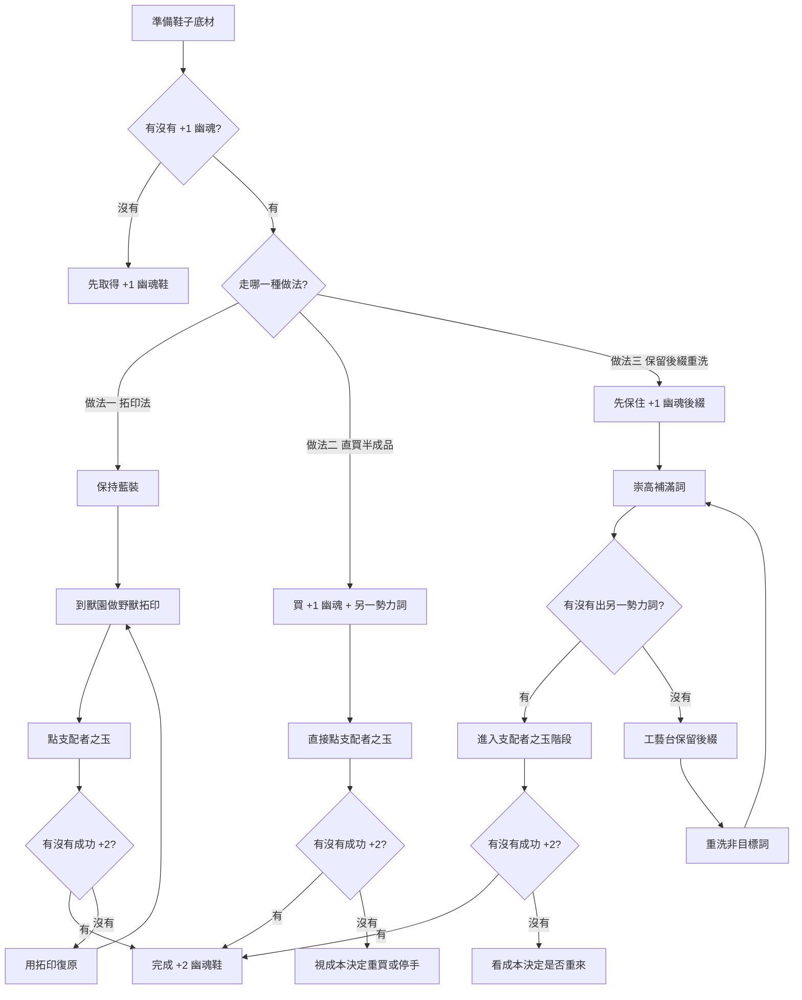

# 裝：+2 幽魂鞋

## 核心目標

- 目標是做出 **+2 幽魂鞋**。
- 核心概念是先有 **+1 幽魂**，再去補上**另一個勢力詞**，最後利用 **支配者之玉** 嘗試升成 +2。
- 這類做裝偏吃素材、運氣與容錯手段，其中**野獸拓印**就是最重要的保險工具。

## 觀念先講

- **藍裝最好**：
  - 因為可以先用野獸做**拓印**。
  - 拓印的概念很像 Git 的 `stash`，失敗後可以把裝備還原回去。
- **+1 幽魂在後綴**：
  - 這點很重要，因為會影響你後面能不能用工藝台做「保留後綴」再重洗。
- **另一個勢力詞**：
  - 你需要讓裝備同時帶有另一個可配合支配者之玉的勢力詞，才有機會往 +2 方向走。

## 重要成本

- **支配者之玉**：
  - 季初約 **3D**
  - 季末約 **7D**
- **工藝台保留後綴**：約 **2D**
- 這代表你在做法一與做法二中，每一次按下支配者之玉，實際上都是一次高成本嘗試。
- 做法三則要額外把 **保後綴 2D** 算進每次失敗重洗的循環成本裡。

## 做法一：藍裝拓印法（最穩觀念）

這是你描述中最有保險的做法，也是最接近「失敗可回復」的版本。

### 流程

1. 準備一雙帶有 **+1 幽魂** 的藍裝鞋。
2. 確認另一個你要賭的勢力詞條件成立。
3. 先到獸園，對這雙鞋做**野獸拓印**。
4. 使用**支配者之玉**去賭是否成功升成 **+2 幽魂鞋**。
5. 如果失敗：
   - 用拓印把裝備還原。
6. 重複以上流程，直到成功。

### 優點

- 有回復手段，容錯最高。
- 失敗成本比較可控。
- 很適合高價底材或高價半成品。

### 缺點

- 需要拓印成本。
- 每次點**支配者之玉**都要承擔季初約 **3D**、季末約 **7D** 的成本。
- 過程偏賭，成功與否看運氣。
- 如果素材本身很貴，前期投入仍然不低。

## 做法二：直接買雙勢力半成品

這是比較偏市場換時間的做法。

### 流程

1. 直接購買一雙已經帶有：
   - **+1 幽魂**
   - **另一個勢力詞**
2. 直接使用**支配者之玉**。
3. 看是否成功往你要的方向升成 **+2 幽魂鞋**。

### 優點

- 流程最短。
- 不用自己慢慢養素材。
- 如果市面上剛好有便宜半成品，可能是最省時間的方式。

### 缺點

- 很吃市價。
- 如果支配者之玉處在季末價格帶，單次失敗代價會很重。
- 半成品不一定好找。
- 買錯詞或底材，很容易多花冤枉錢。

## 做法三：後綴保留重洗法

這是比較偏「慢慢疊」的版本，適合自己動手修裝。

### 流程

1. 準備一雙帶有 **+1 幽魂** 的鞋。
2. 因為 **+1 幽魂在後綴**，先到工藝台上一條**後綴相關保護工藝**。
3. 接著用**崇高石**把詞綴點滿，觀察有沒有出到你要的**另一個勢力詞**。
4. 如果沒出到：
   - 用工藝台做**保留後綴**。
   - 再利用重洗手段把非目標部分洗掉。
5. 重複以上步驟，直到出到你要的另一個勢力詞。
6. 最後再進入支配者之玉階段。

### 優點

- 可以把 `+1 幽魂` 當核心保留下來。
- 適合有耐心慢慢修裝的人。
- 當市場上半成品少時，這種方式更有操作空間。

### 缺點

- 步驟多，成本容易累積。
- 每輪若需要做**保留後綴**，就要額外支出約 **2D**。
- 若對詞綴池不熟，很容易浪費通貨。
- 雖然比純亂點好，但本質仍然是機率型做裝。

## 三種做法怎麼選

- **你想要最高容錯**：選 **做法一（藍裝拓印法）**。
- **你想最快出結果**：選 **做法二（直接買半成品）**。
- **你想自己慢慢修，壓素材市場波動**：選 **做法三（後綴保留重洗法）**。

## 成本比較表

| 做法 | 主要成本 | 優點 | 風險 |
| --- | --- | --- | --- |
| 做法一：藍裝拓印法 | 拓印成本 + 支配者之玉（季初 3D / 季末 7D） | 有保險、可回復、適合高價底 | 每次按支配者之玉都很痛 |
| 做法二：直接買半成品 | 半成品市價 + 支配者之玉（季初 3D / 季末 7D） | 最快、最省時間 | 很吃市場，有時買成品更划算 |
| 做法三：保後綴重洗 | 崇高 / 重洗成本 + 保後綴 2D + 最後支配者之玉 | 可慢慢修、可保核心後綴 | 步驟長，累積成本容易爆掉 |

## 季初 / 季末建議

### 季初
- **支配者之玉約 3D**，還在可接受區間。
- 如果你有素材、願意自己賭，通常會比季末更適合自己做。
- 季初比較偏向：
  - 有底材 → 可以考慮 **做法一**
  - 有便宜半成品 → 可以考慮 **做法二**

### 季末
- **支配者之玉約 7D**，已經是高成本按鈕。
- 這時候重點不是「能不能做」，而是「值不值得自己做」。
- 季末通常建議：
  - 先查成品價
  - 再查半成品價
  - 最後才決定是否自己做
- 很多情況下，**季末直接買成品會比自己賭還划算**。

### 做法選擇建議
- **季初**：偏適合自己賭、自己養裝。
- **季中**：看市場，有便宜半成品時做法二通常最舒服。
- **季末**：優先比價，很多時候直接買成品最好。

## 建議補充

- 若底材夠貴，**先拓印再賭** 幾乎是最直覺的保險思路。
- 若市面上有現成雙勢力半成品，先查市價再決定是否自己做，很多時候**直接買比自己點還便宜**。
- 做法三最吃你對詞綴池的理解，如果不熟，建議先拿便宜底材練手。
- 若是季末才準備做，記得先把**支配者之玉 7D** 的價格算進去，很多時候整體成本會高到不如直接買成品。
- 若你的目的是「可穿可賣」，那要額外考慮：
  - 底材基底
  - 移速
  - 抗性
  - 生命
  - 是否還有可補工藝空間
- 真正有價值的不一定只是 `+2 幽魂`，而是 **+2 幽魂 + 可用後續詞**。

## 簡版流程圖

## 一句話總結

- **做法一最穩、做法二最快、做法三最吃理解。**
- 如果你要的是高價底材保險，優先考慮**藍裝 + 拓印 + 支配者之玉**這條線。

## 成本一句話提醒

- **季初偏適合自己賭，季末要先算成本，很多時候直接買成品更划算。**
